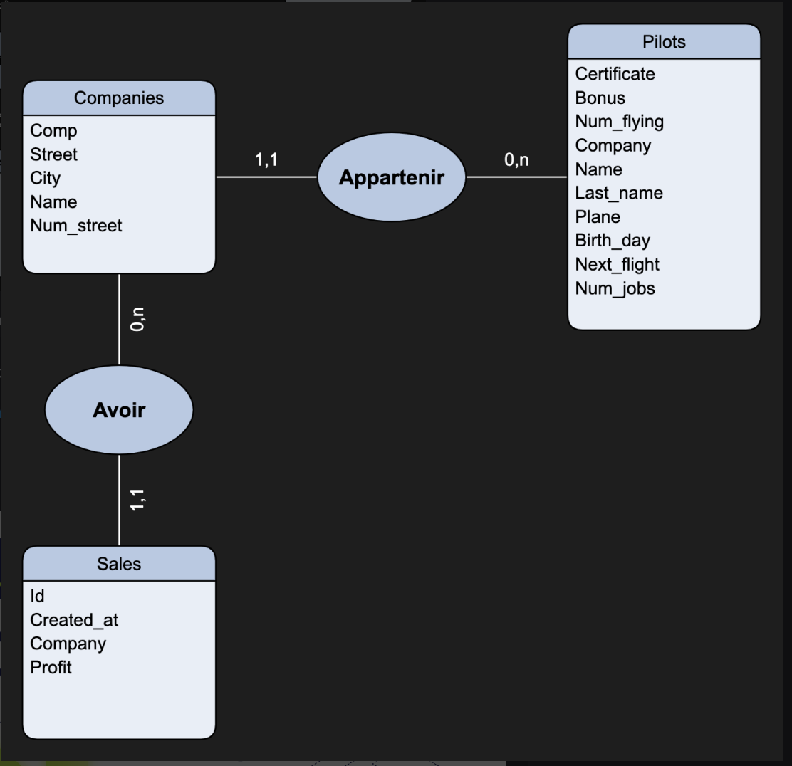

# Model des données

## Base de Données : `db_aviation`

La base de données `db_aviation` est conçue pour gérer des informations sur les compagnies aériennes, les pilotes et les ventes associées. Elle contient trois tables principales : `companies`, `pilots`, et `sales`.

### 1. Table : `companies`

**Description**:  
La table `companies` contient des informations sur les compagnies aériennes. Chaque enregistrement représente une compagnie aérienne unique.

**Structure**:
- **`comp`** (`char(4)`, `NOT NULL`):  
  Code unique identifiant la compagnie aérienne. Ce champ est la clé primaire de la table.
  
- **`street`** (`varchar(20)`):  
  Nom de la rue où se trouve le siège social de la compagnie.
  
- **`city`** (`varchar(20)`):  
  Ville où est située la compagnie aérienne.
  
- **`name`** (`varchar(20)`, `NOT NULL`):  
  Nom officiel de la compagnie aérienne.
  
- **`num_street`** (`smallint(5) unsigned`):  
  Numéro de la rue du siège social de la compagnie.

**Utilisation**:  
Cette table est utilisée pour stocker et référencer les informations des compagnies aériennes pour lesquelles les pilotes travaillent et avec lesquelles les ventes sont associées.

### 2. Table : `pilots`

**Description**:  
La table `pilots` contient des informations sur les pilotes qui travaillent pour les compagnies aériennes. Chaque enregistrement représente un pilote unique.

**Structure**:
- **`certificate`** (`varchar(6)`, `NOT NULL`):  
  Numéro de certificat unique du pilote. Ce champ est la clé primaire de la table.
  
- **`bonus`** (`smallint(5) unsigned`):  
  Montant du bonus du pilote en unités monétaires (comme les dollars ou les euros).
  
- **`num_flying`** (`decimal(7,1)`):  
  Nombre total d'heures de vol du pilote.
  
- **`company`** (`char(4)`):  
  Code de la compagnie aérienne pour laquelle le pilote travaille. Ce champ est une clé étrangère faisant référence à `comp` dans la table `companies`.
  
- **`name`** (`varchar(20)`, `NOT NULL`):  
  Prénom du pilote.
  
- **`last_name`** (`varchar(100)`):  
  Nom de famille du pilote.
  
- **`plane`** (`enum('A380','A320','A340')`):  
  Type d'avion que le pilote est qualifié à piloter.
  
- **`birth_day`** (`datetime`):  
  Date de naissance du pilote.
  
- **`next_flight`** (`datetime`):  
  Date et heure du prochain vol prévu pour le pilote.
  
- **`num_jobs`** (`smallint(5) unsigned`):  
  Nombre total de missions ou vols effectués par le pilote.
  
- **`extra_info`** (`JSON`):  
  Champ JSON contenant des informations supplémentaires sur le pilote, telles que ses compétences (`skills`) et les langues parlées (`languages`).

**Utilisation**:  
Cette table est utilisée pour gérer les informations des pilotes, y compris leurs qualifications, leurs heures de vol et les détails sur leurs missions passées et à venir.

### 3. Table : `sales`

**Description**:  
La table `sales` contient des informations sur les ventes réalisées par les compagnies aériennes. Chaque enregistrement représente une transaction de vente unique.

**Structure**:
- **`id`** (`bigint(20) unsigned`, `NOT NULL`, `AUTO_INCREMENT`):  
  Identifiant unique pour chaque enregistrement de vente. Ce champ est la clé primaire de la table.
  
- **`created_at`** (`date`):  
  Date à laquelle la vente a été enregistrée.
  
- **`company`** (`char(4)`):  
  Code de la compagnie aérienne à laquelle la vente est associée. Ce champ est une clé étrangère faisant référence à `comp` dans la table `companies`.
  
- **`profit`** (`decimal(15,2)`):  
  Montant du bénéfice généré par la vente.

**Utilisation**:  
Cette table est utilisée pour suivre les ventes effectuées par chaque compagnie aérienne et calculer les profits associés.
