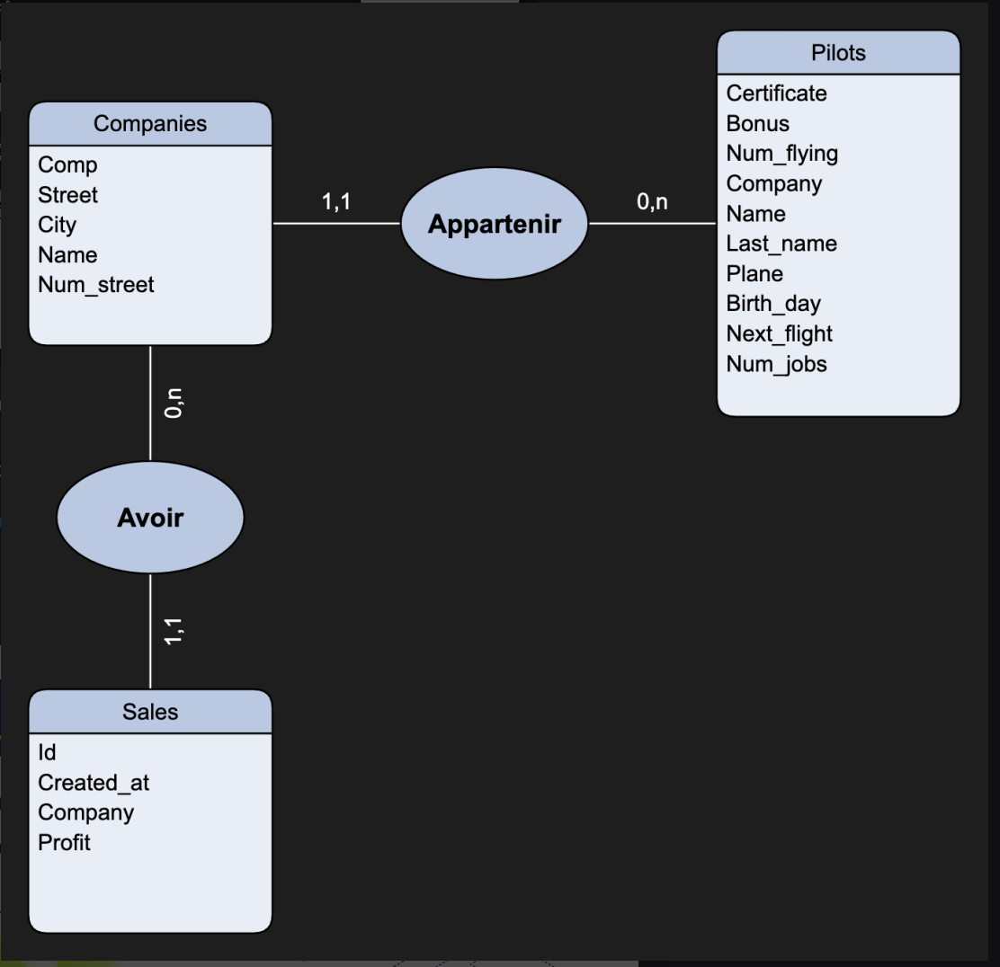

## Cours sur le Data Query Language (DQL) en MySQL

## Installation 

Récupérez le fichier install.sql et exécutez-le (Dossier Docker).

Voici les données que nous utiliserons dans cours, elles servent d'exemple et nous les changerons ou les recrérons dans la semaine.

[INSTALL](../../Docker/scripts/install.sql)

- Le modèle de nos données



- La documentation de nos données

[Documentation MODEL](./MODEL.md)

## Introduction au DQL

Le **Data Query Language (DQL)** est une sous-catégorie du SQL (Structured Query Language) utilisée pour interroger et récupérer des données dans une base de données. En MySQL, le DQL se concentre principalement sur l'instruction `SELECT`, qui est utilisée pour récupérer des données à partir de tables.

## Structure de Base d'une Instruction `SELECT`

La syntaxe de base d'une instruction `SELECT` est la suivante :

```sql
SELECT colonne1, colonne2, ...
FROM table
WHERE conditions
ORDER BY colonne1 ASC|DESC
LIMIT nombre;
```

- **SELECT** : Spécifie les colonnes à récupérer.
- **FROM** : Indique la table à partir de laquelle les données sont récupérées.
- **WHERE** : Filtre les enregistrements selon des conditions spécifiques.
- **ORDER BY** : Trie les résultats selon une ou plusieurs colonnes.
- **LIMIT** : Limite le nombre de résultats retournés.

## 1. Sélection Simple

Pour récupérer des données spécifiques des tables, vous pouvez utiliser une sélection simple.

**Exemple :**

```sql
SELECT name, last_name FROM pilots;
```

Cela récupère les colonnes `name` et `last_name` de la table `pilots`, affichant ainsi le prénom et le nom des pilotes.

## 2. Sélection de Toutes les Colonnes

Pour sélectionner toutes les colonnes d'une table, utilisez l'astérisque `*`.

**Exemple :**

```sql
SELECT * FROM companies;
```

Cela récupère toutes les colonnes de la table `companies`, affichant toutes les informations pour chaque compagnie.

## 3. Utilisation de l'Alias

Les alias permettent de renommer temporairement les colonnes ou les tables pour rendre les résultats plus lisibles.

**Exemple :**

```sql
SELECT name AS pilot_name, last_name FROM pilots AS p;
```

- **AS pilot_name** renomme la colonne `name` en `pilot_name` dans le résultat.
- **AS p** renomme la table `pilots` en `p` pour simplifier la référence.

## 4. Filtrage avec `WHERE`

L'instruction `WHERE` est utilisée pour filtrer les résultats selon certaines conditions.

**Exemple :**

```sql
SELECT name, last_name FROM pilots WHERE plane = 'A320';
```

Cela récupère les noms et prénoms des pilotes qui pilotent un Airbus A320.

## 5. Opérateurs de Comparaison

Les opérateurs de comparaison sont utilisés dans la clause `WHERE` pour filtrer les résultats.

**Exemple :**

```sql
SELECT name, last_name FROM pilots WHERE bonus > 2000;
```

Cela récupère les noms et prénoms des pilotes dont le bonus est supérieur à 2000.

## 6. Utilisation des Opérateurs Logiques

Les opérateurs logiques permettent de combiner plusieurs conditions dans une clause `WHERE`.

**Exemple :**

```sql
SELECT name, last_name FROM pilots WHERE plane = 'A320' AND bonus > 2000;
```

Cela récupère les pilotes qui pilotent un Airbus A320 et qui ont un bonus supérieur à 2000.

## 7. Requêtes avec `ORDER BY`

L'instruction `ORDER BY` trie les résultats en fonction d'une ou plusieurs colonnes.

**Exemple :**

```sql
SELECT name, last_name FROM pilots ORDER BY bonus DESC;
```

Cela trie les résultats par bonus en ordre décroissant, affichant les pilotes avec le plus grand bonus en premier.

## 8. Limitation des Résultats avec `LIMIT`

`LIMIT` est utilisé pour restreindre le nombre de lignes retournées par une requête.

**Exemple :**

```sql
SELECT name, last_name FROM pilots LIMIT 5;
```

Cela récupère les 5 premiers pilotes de la table `pilots`.

## 9. Sélection Distincte avec `DISTINCT`

`DISTINCT` est utilisé pour retourner des valeurs uniques d'une colonne.

**Exemple :**

```sql
SELECT DISTINCT company FROM pilots;
```

Cela récupère toutes les compagnies uniques pour lesquelles les pilotes travaillent.

## 10. Sélection Complexe avec `CASE` et Expressions Conditionnelles

L'instruction `CASE` permet de réaliser des sélections conditionnelles dans une requête SQL, similaire à un `if-else` en programmation.

**Exemple :**

Supposons que nous souhaitions classer les pilotes en fonction de leur bonus dans des catégories ("High", "Medium", "Low") :

```sql
SELECT 
    name, 
    last_name,
    bonus,
    CASE
        WHEN bonus > 3000 THEN 'High'
        WHEN bonus BETWEEN 2000 AND 3000 THEN 'Medium'
        ELSE 'Low'
    END AS bonus_category
FROM pilots;
```

Dans cet exemple, chaque pilote reçoit une catégorie de bonus en fonction de la valeur de son bonus.