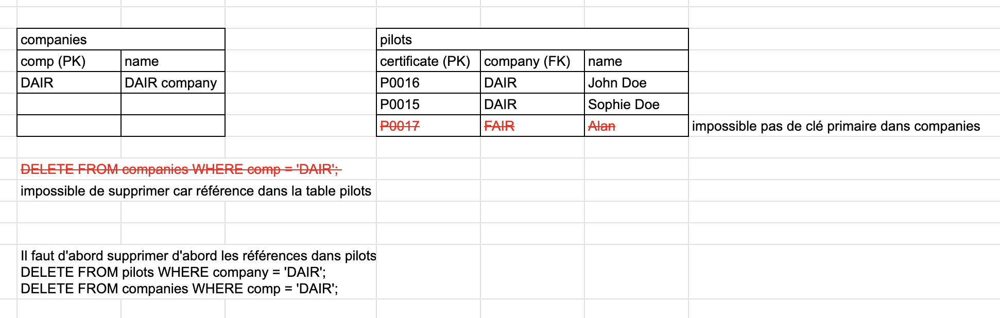

# Théorie sur les Clés Primaires et Étrangères et les Formes Normales

## 1. **Clé Primaire (Primary Key)**

La clé primaire est un concept fondamental dans la conception de bases de données relationnelles. Elle joue un rôle crucial dans l'identification unique de chaque enregistrement au sein d'une table.

- **Définition :** Une clé primaire est un ou plusieurs attributs (colonnes) d'une table qui permettent d'identifier de manière unique chaque enregistrement de cette table. Aucune autre ligne dans la table ne peut avoir la même valeur pour cette clé. 

- **Propriétés :**
  - **Unicité :** La valeur de la clé primaire doit être unique pour chaque enregistrement. Cela garantit qu'aucune duplication ne se produit au niveau de la clé.
  - **Non-nullité :** Une clé primaire ne peut pas contenir de valeur `NULL`. Cela est essentiel pour assurer que chaque enregistrement soit identifiable de manière unique.
  - **Immuabilité :** Idéalement, la valeur de la clé primaire ne devrait pas changer au cours du temps, car cela pourrait entraîner des incohérences dans les relations.

- **Exemple :** Dans une table `pilots`, la colonne `certificate` pourrait être une clé primaire si chaque pilote a un certificat unique. 

```sql
CREATE DATABASE IF NOT EXISTS `db_aviation_2`
CHARACTER SET utf8mb4 COLLATE utf8mb4_unicode_ci;

USE db_aviation_2;

CREATE TABLE pilots (
    certificate VARCHAR(6) PRIMARY KEY,
    name VARCHAR(50) NOT NULL,
    company CHAR(4)
);
```

## 2. **Clé Étrangère (Foreign Key)**

La clé étrangère est un autre concept essentiel dans les bases de données relationnelles, utilisé pour maintenir les relations entre les tables.

- **Définition :** Une clé étrangère est un ou plusieurs attributs d'une table qui font référence à la clé primaire d'une autre table (ou de la même table dans le cas d'une auto-référence). La clé étrangère crée un lien entre les deux tables, assurant ainsi l'intégrité référentielle.

- **Propriétés :**
  - **Référencement :** La clé étrangère pointe vers une clé primaire dans une autre table, établissant ainsi une relation entre les enregistrements des deux tables.
  - **Intégrité Référentielle :** La valeur de la clé étrangère doit correspondre à une valeur existante dans la table référencée, ou être `NULL` si la contrainte le permet.

- **Exemple :** Si nous avons une table `companies` avec une clé primaire `comp`, la colonne `company` dans la table `pilots` pourrait être une clé étrangère faisant référence à cette clé primaire.

  ```sql
  CREATE TABLE companies (
    comp CHAR(4) PRIMARY KEY, -- clé primaire
    name VARCHAR(50) NOT NULL
  );
  -- si table pas encore crée on peut utiliser ce code
  CREATE TABLE pilots (
    certificate VARCHAR(6) PRIMARY KEY,
    name VARCHAR(50) NOT NULL,
    company CHAR(4),
    CONSTRAINT fk_company_comp FOREIGN KEY (company) REFERENCES companies(comp)
  );

   -- si la table existe existe il faut rajouter la clé étrangère ATTENTION les deux clés doivent être identique en terme de type
   ALTER TABLE pilots 
   ADD CONSTRAINT fk_company_comp FOREIGN KEY (company) REFERENCES companies(comp) ;
  ```


## Dans MySQL - coder les contraintes 

Les contraintes d'intégrité en base de données sont essentielles pour garantir la cohérence et la validité des données. Lorsqu'on travaille avec des clés primaires (Primary Key) et des clés étrangères (Foreign Key), certaines règles doivent être respectées, ce qui empêche certaines actions non désirées. Voici quelques exemples pour illustrer ces concepts :

### 1. **Contrainte d'intégrité référentielle avec clé étrangère**

**Scénario :**  
Supposons que nous avons deux tables : `companies` et `pilots`. La table `pilots` contient une clé étrangère `company`, qui fait référence à la clé primaire `comp` de la table `companies`.

```sql
CREATE TABLE companies (
    comp CHAR(4) PRIMARY KEY,
    name VARCHAR(20) NOT NULL
);

CREATE TABLE pilots (
    certificate VARCHAR(6) PRIMARY KEY,
    name VARCHAR(50) NOT NULL,
    company CHAR(4),
    FOREIGN KEY (company) REFERENCES companies(comp)
);
```

#### Exemple 1 : Insertion de données invalides

Si vous essayez d'insérer un pilote avec une valeur de clé étrangère (`company`) qui n'existe pas dans la table `companies`, la base de données refusera cette insertion.

```sql
INSERT INTO pilots (certificate, name, company)
VALUES ('P00016', 'John Doe', 'XXXX');  -- 'XXXX' n'existe pas dans 'companies'
```

**Erreur générée :**  
`ERROR 1452: Cannot add or update a child row: a foreign key constraint fails`

**Explication :**  
Vous ne pouvez pas insérer une clé étrangère (`company = 'XXXX'`) qui ne correspond pas à une clé primaire existante dans la table référencée (`companies`).

#### Exemple 2 : Suppression d'une ligne référencée

Si vous essayez de supprimer une compagnie qui est référencée par un pilote dans la table `pilots`, vous allez rencontrer une contrainte d'intégrité référentielle.

```sql
INSERT INTO companies (comp, name)
VALUES ('DAIR', 'Company DAIR'); 

-- un pilote qui travaille pour la compagnie DAIR

INSERT INTO pilots (certificate, name, company)
VALUES ('P00016', 'John Doe', 'DAIR');

DELETE FROM companies WHERE comp = 'DAIR';  -- 'DAIR' est référencée dans la table 'pilots'
```

**Erreur générée :**  
`ERROR 1451: Cannot delete or update a parent row: a foreign key constraint fails`

**Explication :**  
Vous ne pouvez pas supprimer une clé primaire (`comp = 'DAIR'`) si elle est utilisée comme clé étrangère dans une autre table (`pilots`), à moins de gérer cette suppression avec une stratégie spécifique (comme `ON DELETE CASCADE`).



## 2. **Contrainte d'unicité avec clé primaire**

**Scénario :**  
La clé primaire impose que chaque valeur dans la colonne (ou combinaison de colonnes) définie comme clé primaire soit unique.

#### Exemple 3 : Insertion de doublons

Si vous essayez d'insérer un enregistrement avec une valeur de clé primaire qui existe déjà, la base de données refusera l'insertion.

```sql
INSERT INTO companies (comp, name)
VALUES ('DAIR', 'Duplicate Airline');
```

**Erreur générée :**  
`ERROR 1062: Duplicate entry 'DAIR' for key 'PRIMARY'`

**Explication :**  
La clé primaire (`comp`) doit être unique. Vous ne pouvez pas avoir deux enregistrements avec la même valeur de clé primaire (`'DAIR'`).

### 3. **Contrainte d'intégrité référentielle avec mise à jour**

#### Exemple 4 : Mise à jour d'une clé primaire référencée

Si vous essayez de modifier une valeur de clé primaire dans la table `companies` qui est référencée par une clé étrangère dans la table `pilots`, vous rencontrerez également une contrainte.

```sql
UPDATE companies SET comp = 'DXYZ' WHERE comp = 'DAIR';  -- 'DAIR' est référencée dans la table 'pilots'
```

**Erreur générée :**  
`ERROR 1451: Cannot delete or update a parent row: a foreign key constraint fails`

**Explication :**  
Vous ne pouvez pas modifier une clé primaire si elle est utilisée dans une autre table comme clé étrangère, à moins d'avoir spécifié une action comme `ON UPDATE CASCADE`.

### 4. **Contrainte de non-nullité avec clé étrangère**

#### Exemple 5 : Insertion avec une clé étrangère nulle

Par défaut, une clé étrangère peut accepter des valeurs `NULL`, mais si vous définissez la colonne avec une contrainte `NOT NULL`, l'insertion d'une valeur nulle sera impossible.

```sql
CREATE TABLE pilots (
    certificate VARCHAR(6) PRIMARY KEY,
    name VARCHAR(50) NOT NULL,
    company CHAR(4) NOT NULL,  -- Clé étrangère ne peut pas être NULL
    FOREIGN KEY (company) REFERENCES companies(comp)
);

INSERT INTO pilots (certificate, name, company)
VALUES ('P00017', 'Alice Green', NULL);  -- 'company' ne peut pas être NULL
```

**Erreur générée :**  
`ERROR 1048: Column 'company' cannot be null`

**Explication :**  
La colonne `company` est définie avec la contrainte `NOT NULL`, ce qui signifie qu'elle doit toujours contenir une valeur valide.

Lorsqu'on définit des clés étrangères (Foreign Keys) en SQL, il existe plusieurs options qui permettent de spécifier comment la base de données doit se comporter lors de la mise à jour ou de la suppression des enregistrements liés. Ces options sont importantes pour gérer l'intégrité référentielle, c'est-à-dire pour assurer que les relations entre les tables sont maintenues de manière cohérente.

### Options sur la Définition des Clés Étrangères

Lorsque vous définissez une clé étrangère, vous pouvez spécifier des actions particulières à entreprendre lorsque les enregistrements liés dans la table référencée (parente) sont mis à jour ou supprimés. 

Les options courantes sont :

1. **ON DELETE CASCADE**
2. **ON UPDATE CASCADE**
3. **ON DELETE SET NULL**
4. **ON UPDATE SET NULL**
5. **ON DELETE RESTRICT**
6. **ON UPDATE RESTRICT**

Il peut, selon la SGDB, exister d'autres options sur la définition des clés étrangères.

### 1. **ON DELETE CASCADE**

- **Description :** Lorsque vous supprimez un enregistrement dans la table parente (celle où se trouve la clé primaire), tous les enregistrements dans la table enfant (celle avec la clé étrangère) qui font référence à cet enregistrement sont également supprimés.
  
- **Exemple :**

  ```sql
  CREATE TABLE pilots (
      certificate VARCHAR(6) PRIMARY KEY,
      name VARCHAR(50) NOT NULL,
      company CHAR(4),
      FOREIGN KEY (company) REFERENCES companies(comp) ON DELETE CASCADE
  );
  ```

  **Explication :** Si vous supprimez une compagnie dans la table `companies`, tous les pilotes travaillant pour cette compagnie seront également supprimés de la table `pilots`.

### 2. **ON UPDATE CASCADE**

- **Description :** Lorsque vous mettez à jour une clé primaire dans la table parente, les valeurs correspondantes de la clé étrangère dans la table enfant sont automatiquement mises à jour pour correspondre à la nouvelle valeur.
  
- **Exemple :**

  ```sql
  CREATE TABLE pilots (
      certificate VARCHAR(6) PRIMARY KEY,
      name VARCHAR(50) NOT NULL,
      company CHAR(4),
      FOREIGN KEY (company) REFERENCES companies(comp) ON UPDATE CASCADE
  );
  ```

  **Explication :** Si vous changez le code d'une compagnie dans la table `companies`, le champ `company` dans la table `pilots` sera automatiquement mis à jour pour refléter cette modification.

### 3. **ON DELETE SET NULL**

- **Description :** Lorsque vous supprimez un enregistrement dans la table parente, les enregistrements correspondants dans la table enfant voient leur clé étrangère mise à `NULL`.
  
- **Exemple :**

  ```sql
  CREATE TABLE pilots (
      certificate VARCHAR(6) PRIMARY KEY,
      name VARCHAR(50) NOT NULL,
      company CHAR(4),
      FOREIGN KEY (company) REFERENCES companies(comp) ON DELETE SET NULL
  );
  ```

  **Explication :** Si vous supprimez une compagnie dans la table `companies`, les pilotes travaillant pour cette compagnie auront la valeur de leur colonne `company` mise à `NULL`.

### 4. **ON UPDATE SET NULL**

- **Description :** Lorsque vous mettez à jour une clé primaire dans la table parente, les valeurs correspondantes de la clé étrangère dans la table enfant sont mises à `NULL`.
  
- **Exemple :**

  ```sql
  CREATE TABLE pilots (
      certificate VARCHAR(6) PRIMARY KEY,
      name VARCHAR(50) NOT NULL,
      company CHAR(4),
      FOREIGN KEY (company) REFERENCES companies(comp) ON UPDATE SET NULL
  );
  ```

  **Explication :** Si vous changez le code d'une compagnie dans la table `companies`, la colonne `company` dans la table `pilots` sera mise à `NULL` pour les pilotes concernés.

### 5. **ON DELETE RESTRICT**

- **Description :** Empêche la suppression d'un enregistrement dans la table parente s'il existe des enregistrements correspondants dans la table enfant.
  
- **Exemple :**

  ```sql
  CREATE TABLE pilots (
      certificate VARCHAR(6) PRIMARY KEY,
      name VARCHAR(50) NOT NULL,
      company CHAR(4),
      FOREIGN KEY (company) REFERENCES companies(comp) ON DELETE RESTRICT
  );
  ```

  **Explication :** Si vous essayez de supprimer une compagnie dans la table `companies` qui est encore référencée par un ou plusieurs pilotes, la suppression sera refusée.

### 6. **ON UPDATE RESTRICT**

- **Description :** Empêche la mise à jour d'une clé primaire dans la table parente s'il existe des enregistrements correspondants dans la table enfant.
  
- **Exemple :**

  ```sql
  CREATE TABLE pilots (
      certificate VARCHAR(6) PRIMARY KEY,
      name VARCHAR(50) NOT NULL,
      company CHAR(4),
      FOREIGN KEY (company) REFERENCES companies(comp) ON UPDATE RESTRICT
  );
  ```

  **Explication :** Si vous essayez de modifier le code d'une compagnie dans la table `companies` qui est encore référencée par un ou plusieurs pilotes, la mise à jour sera refusée.
