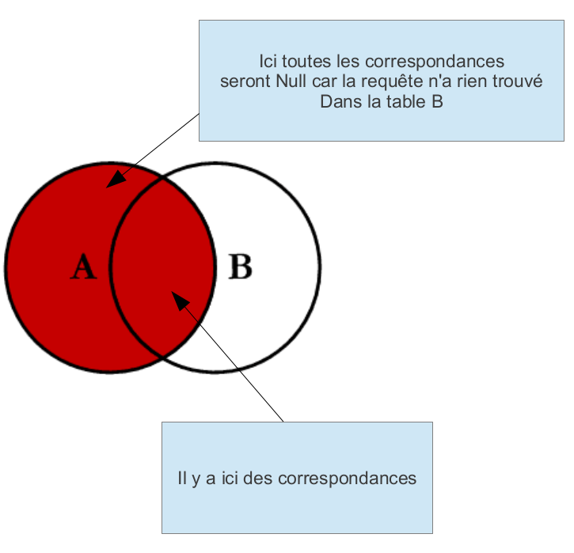
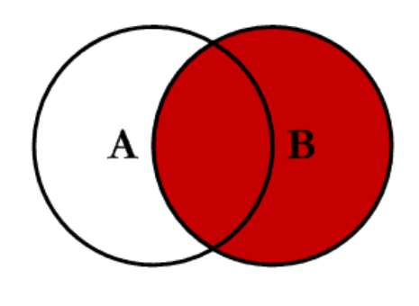

# Les Jointures en SQL

Les jointures sont des opérations fondamentales en SQL qui permettent de combiner des lignes de plusieurs tables en fonction d'une condition spécifique. Ce cours couvre les types de jointures les plus courants et explique comment utiliser ces opérations pour extraire et combiner des données de manière efficace.

## 1. Introduction aux Jointures

En SQL, une jointure est utilisée pour lier des tables entre elles en fonction d'une colonne commune. Cela permet de récupérer des données qui sont réparties sur plusieurs tables, offrant une vue plus complète des informations.

### 1.1. Concepts de Base

Une jointure combine les lignes de deux tables en fonction d'une condition de correspondance. Voici les principaux types de jointures :

- **INNER JOIN** : Retourne uniquement les lignes avec des correspondances dans les deux tables.
- **LEFT JOIN** (ou `LEFT OUTER JOIN`) : Retourne toutes les lignes de la table de gauche et les lignes correspondantes de la table de droite.
- **RIGHT JOIN** (ou `RIGHT OUTER JOIN`) : Retourne toutes les lignes de la table de droite et les lignes correspondantes de la table de gauche.
- **FULL OUTER JOIN** : Retourne toutes les lignes lorsque les conditions de jointure sont remplies dans l'une ou l'autre des tables.

## 2. Visualisation des Jointures avec des Schémas d'Ensembles

Pour comprendre comment fonctionnent les jointures, nous utiliserons des représentations graphiques sous forme de schémas d'ensembles avec Mermaid.

### 2.1. `INNER JOIN`

L'`INNER JOIN` combine les lignes des deux tables où il y a une correspondance sur les colonnes spécifiées.

Si il n'y a pas de correspondance, les données ne sont pas dans la jointure, principe de l'intersection.


**Exemple SQL :**

```sql
SELECT 
    a.name AS employee_name, 
    b.name AS department_name
FROM A AS a
INNER JOIN B AS b 
ON a.department_id = b.id;
```

### 2.2. `LEFT JOIN`

L'`LEFT JOIN` retourne toutes les lignes de la table de gauche, et les lignes correspondantes de la table de droite. Les colonnes de la table de droite seront `NULL` pour les lignes sans correspondance.



Exemple :

Imaginons que nous ayons deux tables :

- pilots (table de gauche) : Contient des informations sur les pilotes.
- companies (table de droite) : Contient des informations sur les compagnies aériennes.

**Exemple SQL :**

```sql
SELECT p.name, c.name as company_name
FROM pilots p  -- table de gauche TABLE DOMINANTE
LEFT JOIN companies c  -- table de droite 
ON p.company = c.comp;
```

**Ce que fait le LEFT JOIN :**

1. Toutes les lignes de la table pilots (gauche) seront incluses dans le résultat.
2. Si un pilote n'a pas de compagnie associée dans la table companies, les colonnes de la table companies (droite) auront la valeur NULL.
3. Si un pilote a une correspondance dans companies, les informations de cette compagnie seront affichées.

Schéma :

```txt
pilots              companies          Résultat (LEFT JOIN)
-------             ----------         ----------------------
name   company      comp   name        p.name        company_name
----   -------      ----   ----        ----        ------------
John   DAIR         DAIR   Airline D   John        Airline D
Emma   EAIR         EAIR   Airline E   Emma        Airline E
Tom    NULL         BAIR   Airline B   Tom         NULL   <-- Pilote sans compagnie pilots TABLE DOMINANTE
```

### 2.3. `RIGHT JOIN`

Dans une jointure RIGHT JOIN, la table de droite est dominante. Cela signifie que toutes les lignes de la table de droite (celle mentionnée après le JOIN) seront affichées, même si elles n'ont pas de correspondance dans la table de gauche.


**Exemple SQL :**

```sql
SELECT p.name, c.name as company_name
FROM pilots p
RIGHT JOIN companies c -- table de droite DOMINANTE
ON p.company = c.comp;

```

Ce que fait le RIGHT JOIN :

1. Toutes les lignes de la table companies (droite) seront incluses dans le résultat.
2. Si une compagnie n'a pas de pilote correspondant dans la table pilots, les colonnes de la table pilots (gauche) auront la valeur NULL.
3. Si une compagnie a une correspondance dans pilots, les informations sur les pilotes seront affichées.

schéma: 

```txt
pilots              companies          Résultat (RIGHT JOIN)
-------             ----------         ----------------------
name   company      comp   name        name        company_name
----   -------      ----   ----        ----        ------------
John   DAIR         DAIR   Airline D   John        Airline D
Emma   EAIR         EAIR   Airline E   Emma        Airline E
                    BAIR   Airline B   NULL        Airline B   <-- Compagnie sans pilote table DOMINANTE

```

## Résumé des Dominances
- LEFT JOIN : La table de gauche est dominante, donc toutes les lignes de cette table seront incluses dans le résultat, avec des NULL dans la table de droite si pas de correspondance.
- RIGHT JOIN : La table de droite est dominante, donc toutes les lignes de cette table seront incluses, avec des NULL dans la table de gauche si pas de correspondance.


### 2.4. `FULL OUTER JOIN`

Le `FULL OUTER JOIN` combine les résultats de `LEFT JOIN` et `RIGHT JOIN`, incluant toutes les lignes des deux tables, avec des valeurs `NULL` là où il n'y a pas de correspondance.

**Explication :**

- **Tous les éléments** : Tous les éléments de Table A et Table B sont inclus, même ceux sans correspondance dans l'autre table.

**Note :** MySQL ne supporte pas directement `FULL OUTER JOIN`, mais vous pouvez simuler ce comportement avec une combinaison de `LEFT JOIN` et `RIGHT JOIN`.

**Exemple SQL :**

```sql
SELECT 
    a.name AS employee_name, 
    d.name AS department_name
FROM A a
LEFT JOIN B b ON b.department_id = a.id

UNION

SELECT 
    a.name AS employee_name, 
    d.name AS department_name
FROM A a
RIGHT JOIN B b ON b.department_id = a.id
```

## 3. Applications Pratiques des Jointures

### 3.1. `INNER JOIN`

- **Utilisation** : Pour récupérer uniquement les données correspondantes dans les deux tables.

### 3.2. `LEFT JOIN`

- **Utilisation** : Pour obtenir toutes les lignes de la table de gauche, avec les informations correspondantes de la table de droite, si disponibles.

### 3.3. `RIGHT JOIN`

- **Utilisation** : Pour obtenir toutes les lignes de la table de droite, avec les informations correspondantes de la table de gauche, si disponibles.

### 3.4. `FULL OUTER JOIN`

- **Utilisation** : Pour obtenir toutes les lignes des deux tables, indépendamment de la correspondance.

## Exemples avec les tables du cours 

Avec les données d'exemple dans la BD db_aviations_2

```txt
SELECT 
    p.name as name_pilot, 
    c.name as name_company
FROM pilots AS p
INNER JOIN companies AS c 
ON p.company = c.comp ;


+------------+--------------+
| name_pilot | name_company |
+------------+--------------+
| David Johe | DAIR company |
| Lucile Ju  | DAIR company |
| Mathieu C  | FAIR company |
+------------+--------------+

- pilots

+-------------+------------+---------+
| certificate | name       | company |
+-------------+------------+---------+
| P001        | John Doe   | NULL    |
| P0019       | David Johe | DAIR    |
| P002        | David Doe  | NULL    |
| P0021       | Lucile Ju  | DAIR    |
| P0087       | Mathieu C  | FAIR    |
+-------------+------------+---------+

- companies 

+------+------------------+
| comp | name             |
+------+------------------+
| DAIR | DAIR company     |
| FAIR | FAIR company     |
| FRA  | France compagnie |
+------+------------------+

SELECT 
    p.name as name_pilot, 
    c.name as name_company
FROM pilots as p
RIGHT JOIN companies AS c 
ON p.company = c.comp ;

+------------+------------------+
| name_pilot | name_company     |
+------------+------------------+
| David Johe | DAIR company     |
| Lucile Ju  | DAIR company     |
| Mathieu C  | FAIR company     |
| NULL       | France compagnie |
+------------+------------------+

SELECT 
    p.name as name_pilot, 
    c.name as name_company
FROM pilots as p
LEFT JOIN companies AS c 
ON p.company = c.comp ;

+------------+--------------+
| name_pilot | name_company |
+------------+--------------+
| John Doe   | NULL         |
| David Johe | DAIR company |
| David Doe  | NULL         |
| Lucile Ju  | DAIR company |
| Mathieu C  | FAIR company |
+------------+--------------+

--- Toutes les correspondances 

SELECT 
    p.name as name_pilot, 
    c.name as name_company
FROM pilots as p
RIGHT JOIN companies AS c 
ON p.company = c.comp 

UNION

SELECT 
    p.name as name_pilot, 
    c.name as name_company
FROM pilots as p
LEFT JOIN companies AS c 
ON p.company = c.comp ;

+------------+------------------+
| name_pilot | name_company     |
+------------+------------------+
| Lucile Ju  | DAIR company     |
| David Johe | DAIR company     |
| Mathieu C  | FAIR company     |
| NULL       | France compagnie |
| John Doe   | NULL             |
| David Doe  | NULL             |
+------------+------------------+
```
