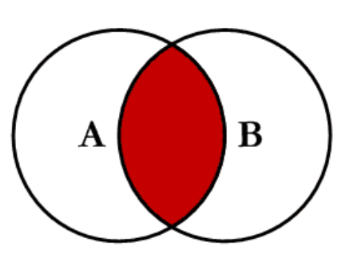
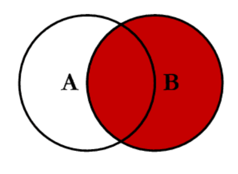

# Les Jointures en SQL

Les jointures sont des opérations fondamentales en SQL qui permettent de combiner des lignes de plusieurs tables en fonction d'une condition spécifique. Ce cours couvre les types de jointures les plus courants et explique comment utiliser ces opérations pour extraire et combiner des données de manière efficace.

## 1. Introduction aux Jointures

En SQL, une jointure est utilisée pour lier des tables entre elles en fonction d'une colonne commune. Cela permet de récupérer des données qui sont réparties sur plusieurs tables, offrant une vue plus complète des informations.

### 1.1. Concepts de Base

Une jointure combine les lignes de deux tables en fonction d'une condition de correspondance. Voici les principaux types de jointures :

- **INNER JOIN** : Retourne uniquement les lignes avec des correspondances dans les deux tables.
- **LEFT JOIN** (ou `LEFT OUTER JOIN`) : Retourne toutes les lignes de la table de gauche et les lignes correspondantes de la table de droite.
- **RIGHT JOIN** (ou `RIGHT OUTER JOIN`) : Retourne toutes les lignes de la table de droite et les lignes correspondantes de la table de gauche.
- **FULL OUTER JOIN** : Retourne toutes les lignes lorsque les conditions de jointure sont remplies dans l'une ou l'autre des tables.

## 2. Visualisation des Jointures avec des Schémas d'Ensembles

Pour comprendre comment fonctionnent les jointures, nous utiliserons des représentations graphiques sous forme de schémas d'ensembles avec Mermaid.

### 2.1. `INNER JOIN`

L'`INNER JOIN` combine les lignes des deux tables où il y a une correspondance sur les colonnes spécifiées.

Si il n'y a pas de correspondance, les données ne sont pas dans la jointure, principe de l'intersection.



**Exemple SQL :**

```sql
SELECT 
    a.name AS employee_name, 
    b.name AS department_name
FROM A AS a
INNER JOIN B AS b 
ON a.department_id = b.id;
```

### 2.2. `LEFT JOIN`

L'`LEFT JOIN` retourne toutes les lignes de la table de gauche, et les lignes correspondantes de la table de droite. Les colonnes de la table de droite seront `NULL` pour les lignes sans correspondance.


**Exemple SQL :**

```sql
SELECT 
    a.name AS employee_name, 
    b.name AS department_name
FROM B AS b
LEFT JOIN A AS a 
ON b.department_id = a.id;
```

### 2.3. `RIGHT JOIN`

L'`RIGHT JOIN` retourne toutes les lignes de la table de droite, et les lignes correspondantes de la table de gauche. Les colonnes de la table de gauche seront `NULL` pour les lignes sans correspondance.


**Exemple SQL :**

```sql
SELECT 
    a.name AS employee_name, 
    b.name AS department_name
FROM A as a
RIGHT JOIN B AS b 
ON b.department_id = a.id;
```

### 2.4. `FULL OUTER JOIN`

Le `FULL OUTER JOIN` combine les résultats de `LEFT JOIN` et `RIGHT JOIN`, incluant toutes les lignes des deux tables, avec des valeurs `NULL` là où il n'y a pas de correspondance.

**Explication :**

- **Tous les éléments** : Tous les éléments de Table A et Table B sont inclus, même ceux sans correspondance dans l'autre table.

**Note :** MySQL ne supporte pas directement `FULL OUTER JOIN`, mais vous pouvez simuler ce comportement avec une combinaison de `LEFT JOIN` et `RIGHT JOIN`.

**Exemple SQL :**

```sql
SELECT 
    a.name AS employee_name, 
    d.name AS department_name
FROM A a
LEFT JOIN B b ON b.department_id = a.id

UNION

SELECT 
    a.name AS employee_name, 
    d.name AS department_name
FROM A a
RIGHT JOIN B b ON b.department_id = a.id
```

## 3. Applications Pratiques des Jointures

### 3.1. `INNER JOIN`

- **Utilisation** : Pour récupérer uniquement les données correspondantes dans les deux tables.

### 3.2. `LEFT JOIN`

- **Utilisation** : Pour obtenir toutes les lignes de la table de gauche, avec les informations correspondantes de la table de droite, si disponibles.

### 3.3. `RIGHT JOIN`

- **Utilisation** : Pour obtenir toutes les lignes de la table de droite, avec les informations correspondantes de la table de gauche, si disponibles.

### 3.4. `FULL OUTER JOIN`

- **Utilisation** : Pour obtenir toutes les lignes des deux tables, indépendamment de la correspondance.
