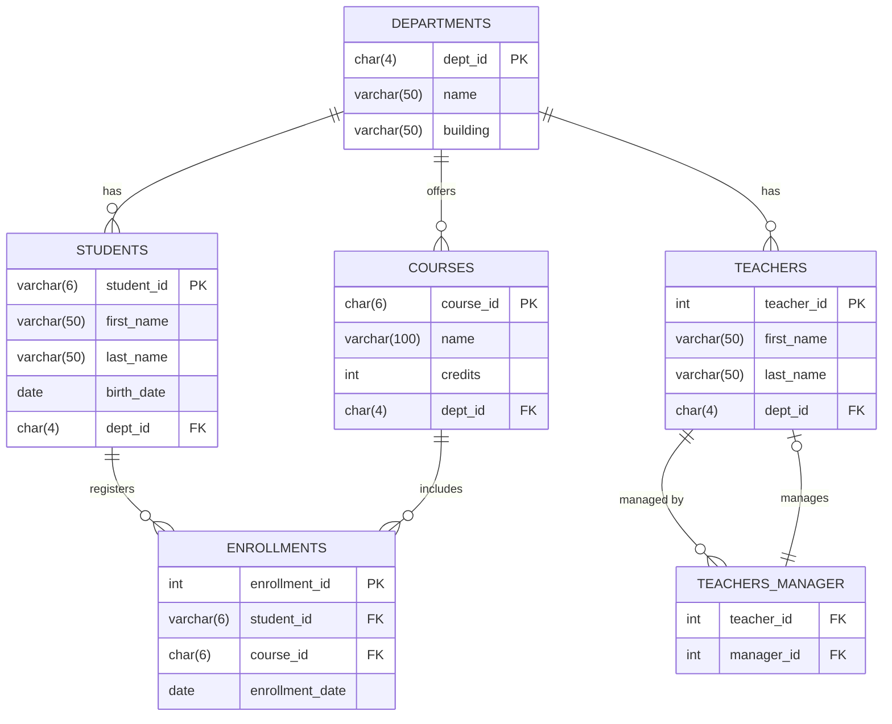

# TP SQL : Gestion d'une Université

# Contexte

Vous allez construire une base de données pour la gestion des informations d'une université. Vous gérerez les étudiants, les cours, les enseignants, les départements et la hiérarchie de gestion des enseignants (responsables). Le système devra suivre les inscriptions aux cours et les enseignants qui dirigent les départements.

# Étapes du TP

## **Étape 1 : Création des Tables**
Vous devez créer les tables suivantes :
- `departments` : pour stocker les informations des départements universitaires.
- `students` : pour enregistrer les informations sur les étudiants.
- `courses` : pour répertorier les cours offerts par chaque département.
- `teachers` : pour suivre les enseignants et leurs départements.
- `enrollments` : pour gérer les inscriptions des étudiants dans les cours.
- `teacher_manager` : une table d'association pour gérer les enseignants responsables d'autres enseignants, c'est une table d'association avec les clés étrangères `teacher_id` et `manager_id`, un enseignant-manager peut manager plusieurs enseignants et un enseignant peut être managé par plusieurs enseignant-managers.




### 1.1. Création de la table `departments`

```sql
CREATE TABLE departments (
   
);
```

### 1.2. Création de la table `students`

```sql
CREATE TABLE students (
   
);
```

### 1.3. Création de la table `courses`

```sql
CREATE TABLE courses (
    
);
```

### 1.4. Création de la table `teachers`

```sql
CREATE TABLE teachers (
   
);
```

### 1.5. Création de la table `enrollments`

```sql
CREATE TABLE enrollments (
    
);
```

### 1.6. Création de la table `teachers_manager` (auto-référencée)

```sql
CREATE TABLE teachers_manager (
  
);
```

## **Étape 2 : Insertion de Données**

### 2.1. Insertion des départements

```sql
INSERT INTO departments (dept_id, name, building) VALUES
('CS', 'Computer Science', 'Engineering Hall'),
('MATH', 'Mathematics', 'Math Building'),
('PHYS', 'Physics', 'Science Complex');
```

### 2.2. Insertion des étudiants

```sql
INSERT INTO students (student_id, first_name, last_name, birth_date, dept_id) VALUES
('S001', 'Alice', 'Smith', '2001-05-15', 'CS'),
('S002', 'Bob', 'Johnson', '2000-09-12', 'MATH'),
('S003', 'Charlie', 'Brown', '1999-11-23', 'PHYS'),
('S004', 'Dana', 'White', '2002-07-30', NULL); -- Étudiant sans département
```

### 2.3. Insertion des cours

```sql
INSERT INTO courses (course_id, name, dept_id, credits) VALUES
('CS101', 'Introduction to Computer Science', 'CS', 4),
('MATH101', 'Calculus I', 'MATH', 3),
('PHYS101', 'Physics I', 'PHYS', 4),
('CS201', 'Data Structures', 'CS', 4),
('MATH201', 'Linear Algebra', 'MATH', 3);
```

### 2.4. Insertion des enseignants

```sql
INSERT INTO teachers (first_name, last_name, dept_id) VALUES
('John', 'Doe', 'CS'),
('Jane', 'Smith', 'MATH'),
('Michael', 'Johnson', 'PHYS'),
('Emily', 'Clark', 'CS');
```

### 2.5. Insertion des inscriptions aux cours

```sql
INSERT INTO enrollments (student_id, course_id, enrollment_date) VALUES
('S001', 'CS101', '2023-09-01'),
('S001', 'CS201', '2023-09-15'),
('S002', 'MATH101', '2023-09-10'),
('S003', 'PHYS101', '2023-09-20');
```

### 2.6. Insertion des relations managers-enseignants

```sql
INSERT INTO teachers_manager (teacher_id, manager_id) VALUES
(1, 2), -- John Doe est supervisé par Jane Smith
(3, 2), -- Michael Johnson est supervisé par Jane Smith
(4, 1); -- Emily Clark est supervisée par John Doe
```

## **Étape 3 : Requêtes SQL**

Faites les requêtes suivantes

### 3.1. Requêtes d'agrégation avec `GROUP BY`

1. **Nombre d'inscriptions par étudiant :**

2. **Nombre total de crédits par département :**

### 3.2. Requêtes de jointure interne (`INNER JOIN`)

1. **Liste des étudiants avec leur département :**

2. **Liste des cours et le département auquel ils appartiennent :**


### 3.3. Requêtes de jointure externe (`LEFT JOIN` et `RIGHT JOIN`)

1. **Liste des étudiants et leurs départements, incluant ceux sans département :**

2. **Liste des départements et les cours associés, incluant ceux sans cours :**

### 3.4. Requêtes avec auto-référence

1. **Liste des enseignants et leurs superviseurs :**

## **Étape 4 : Mise à jour et suppression de données**

### 4.1. Mettre à jour les crédits d'un cours :

### 4.2. Supprimer une inscription :
